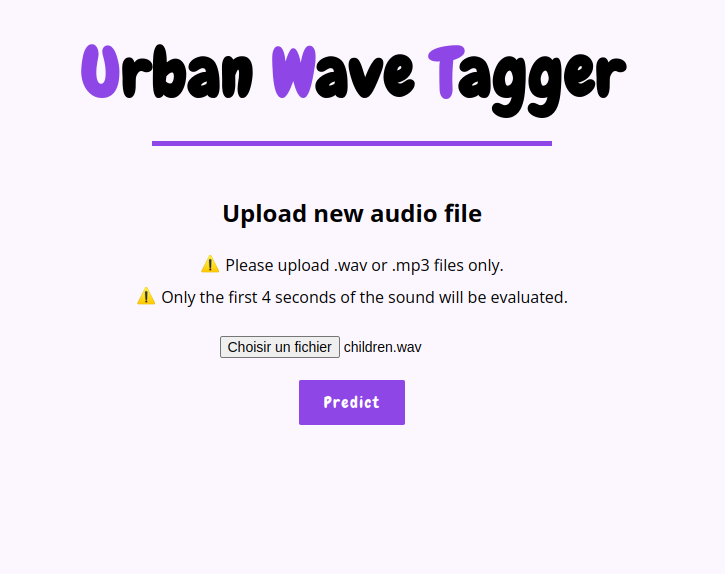

# Urban Wave Tagger


<center style="padding:30px 0" >
    
    <br>
</center>


## Overview
Urban Wave Tagger is an innovative application developed as part of an academic project. It is designed to assist in the recognition and tagging of urban sounds. Users can upload sound files in .wav or .mp3 formats, which are then processed through a custom-built API leveraging a machine learning model trained on the UrbanSound8k dataset.

## Features

- **Sound File Upload:** Users can upload sound files in .wav and .mp3 formats directly through the application interface.
- **Sound Recognition:** Utilizes a custom API to predict the type of urban sound using a pre-trained model. The model is based on the comprehensive UrbanSound8k dataset, which includes a diverse array of urban sound snippets.
- **Prediction Verification:** After a sound is predicted, users have the option to confirm whether the prediction was accurate. If the prediction does not match the actual sound, users can label it correctly.
- **Label Correction and Storage:** Correctly labeled sounds, whether verified or corrected, are then stored in cloud storage. This repository not only serves as a storage solution but also facilitates the potential retraining of the model to enhance its accuracy and broaden its predictive capabilities.
<br/>

## Important Setup Information

The Urban Wave Tagger is specifically designed for recognizing and tagging urban sounds, utilizing AWS services for processing and securely storing uploaded sound files. For optimal functionality, the application typically requires the deployment of a custom-built API as well as the setup of AWS credentials and configuration of an AWS S3 bucket to store sound samples and their associated tags.

<u><b>API Source Code</b></u>: If you prefer to run the API locally, the source code for the API, which integrates the machine learning model, is available at this GitHub repository: Audio API Repository. This allows for local testing and development without deploying to AWS.

While the API can be run locally for development or testing purposes, please note that the sound tagging functionality that involves labeling and storing sound files will not operate unless you set up an AWS S3 bucket. To enable full functionality, including sound file storage and retrieval, you must provide the necessary AWS bucket settings in your environment variables.

## Getting Started

Clone the repository:
```
git clone https://github.com/rpdev63/urban-wav-tagger.git
```

### Environment Variables

Create a `.env` file in the root directory of your project and fill it with the necessary API credentials and configurations. Replace the `<placeholder>` with your actual values.

```plaintext
API_ENDPOINT=<api_endpoint_uri>
AWS_ACCESS_KEY_ID=<your_aws_access_key_id>
AWS_SECRET_ACCESS_KEY=<your_aws_secret_access_key
```

### Option 1 : Local Environment Setup

Prerequisites : 
- Python 3.10 or higher
- Recommended OS: Linux

To run the application locally, follow these steps:

```bash
python -m venv env
source env/bin/activate
python -m pip install --upgrade pip
pip install -r requirements.txt
export FLASK_SESSION_KEY=$(openssl rand -base64 32)
python app.py
```

### Option 2 : Use Dockerized Application

Replace the `<placeholder>` 

```bash
docker build -t <user_name/app_name> .
```
```bash
docker run --env-file .env <user_name/app_name>
```


